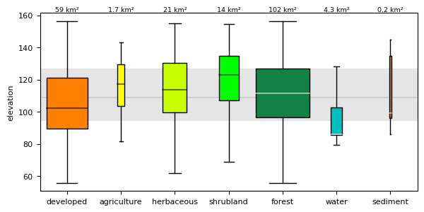

## DESCRIPTION

*r.boxplot* draws boxplots of the raster values of an input raster map. The
user has the option to define a zonal (categorical) map. In that case, a
boxplot will be drawn for each zone, using the values of the input raster that
fall within that zone.

If there is a zonal map, the user can add a line and band to represent the
median and interquartile range (IQR) of the input layer. Note that all values
of the input raster (within the region's extent) are used to compute the median
and IQR. If the zones of the zonal map cover only part of the region, the user
can mask out the non-covered parts of the input map first by means of *r.mask*.
That will result in an IQR and median representing the values that fall within
the zones of the zonal map only. Otherwise, the computational region can be
changed to fit the extent of the zonal map with *g.region*.

To visually account for differences in the total area covered by each zone, you
can optionally scale the width of each boxplot proportionally to the area of
its corresponding category using the **bx_width_variable** option. This can be
done linearly or using the square root of the area, depending on the selected
mode (linear or sqrt). In addition, the user can opt to print the area of each
zone above the boxplot.

By default, the resulting plot is displayed on screen. However, the user can
also save the plot to file using the **output** option. The format is
determined by the extension given by the user. So, if output = outputfile.png,
the plot will be saved as a PNG file.

The whiskers extend to the most extreme data point, which is no more than
**range** ✕ the IQR from the box. By default, a **range** of `1.5` is used, but
the user can change this. Note that range values need to be larger than `0`.

By default, outliers are not included in the plot. Set the **-o** flag to
include them in the plot. To also create a point vector map with the locations
of the outliers, the user needs to provide the name of the output map using
**map\_outliers**.

There are a few layout options, including the option to rotate the plot and the
x-axis labels, print the boxplot(s) with notches, sort the boxplot from low to
high (ascending) or from high to low (descending) median, color the boxplots
according to the corresponding categories of the zonal raster, set the type and
color of the outliers, set the color and width of the median line(s), set the
color and transparency of the raster's median line and IQR band, and set the
width of the boxplots.

## NOTE

The *r.boxplot* module operates on the raster array defined by the current
region settings, not the original extent and resolution of the input map. See
[g.region](https://grass.osgeo.org/grass-stable/manuals/r.univar.html) to
understand the impact of the region settings on the calculations. To include
outliers, the function converts the raster cell with outlier values to a point
vector layer. This may take some time if there are a lot of outliers. So, if
users are working with very large raster layers, they should be cautious to not
set the **range** value too low as that may result in a huge number of
outliers.

The zonal map needs to be an integer map. If it is not, the function will exit
with the error message, 'The zonal raster must be of type CELL (integer)'.

If the **-c** flag is used, the **bxp\_color** and **median\_color** are
ignored, even if set by the user. The option to color boxploxs using the colors
of the zonal raster categories (**c** flag) only works if the zonal map
contains a color table. If it does not, the function exits with the error
message that 'The zonal map does not have a color table'. If the user thinks
there is a color table, run *r.colors.out* and check if the categories are
integers. If not, that is the problem. If they are all integers, you probably
have caught a bug.

The module respects the mask (if set), and the region settings. This means you
can quickly change the area for which to create a boxplot by simply changing
the region and/or setting a (different) mask.

## EXAMPLE

### Example 1

Draw a boxplot of the values of the `elevation` layer from the [NC sample
dataset](https://grass.osgeo.org/download/data/). Set the **-h** flag to print
the boxplot horizontally. Set the plot dimensions to 7 inch wide, 1 inch high.

```sh
g.region raster=elevation
r.boxplot -h input=elevation plot_dimensions="7,1" output="r_boxplot_01.png"
```

  

### Example 2

Draw boxplots of the values of the `elevation` layer per category from
the `landclass96` layer from the same [NC sample
dataset](https://grass.osgeo.org/download/data/). Use the **-r** flag to
rotate the x-asis labels.

```sh
r.boxplot -r input=elevation zone=landclass96 output="r_boxplot_02.png"
```

  

### Example 3

Draw boxplots of the values of the `elevation` layer per category from the
`landclass96` layer from the same [NC sample
dataset](https://grass.osgeo.org/download/data/). Set the **-o** flag to
include outliers. Use **bx\_sort=ascending** to order the boxplots from low to
high median. Provide a name for the outlier map to save the outlier locations
as a point vector map.

```sh
r.boxplot -o bx_sort=ascending input=elevation zones=landclass96 output="r_boxplot_03.png" map_outliers="outliers"
```

  

Below, part of the `landclass96` raster map is shown, with the vector
point layer with location of outliers on top. Curiously, for some lakes,
only part of the raster cells are outliers.

  

### Example 4

Draw boxplots of the values of the `elevation` layer per category from the
`landclass96` layer from the same [NC sample
dataset](https://grass.osgeo.org/download/data/). Set the **-c** flag to color
the boxplots, use **bx\_sort=ascending** to order the boxplots from low to high
median, and set the font size to 11.

```sh
r.boxplot -c bx_sort=ascending fontsize=11 input=elevation zones=landclass96 output="r_boxplot_04.png"
```

### Example 5

To make it easier to compare the elevation distribution across the
different land classes, you can plot a line and band representing the
median and interquartile range of the whole raster layer.

```sh
r.boxplot -c input=elevation zones=landclass96 raster_statistics=median,IQR
```

Note, if the zones of your zonal map do not cover the entire area, you
may want to use *r.mask* to mask out the non-covered parts of the input
map, or alternatively, create a new input raster with only values within
the zones of the zonal layer.


### Example 6

To visualize the differences in surface area per land use category,
you can set the width of the boxplots proportionally to the surface
area or the square root of the surface area. The width of the
largest zone is always set to the user-defined maximum
(specified by **bxp_width**), and all other box widths are
scaled relative to that.

```sh
r.boxplot -c input=elevation zones=landclass96 raster_statistics=median,IQR bx_width=1 bx_width_variable="sqrt" area_label="km2" 
```

The code above also print the surface area of each zone above
the corresponding boxplot in square kilometers.



## Acknowledgements

This work was carried in the framework of the [Save the tiger, save the
grassland, save the water](https://savethetiger.nl/) project by the [Innovative
Bio-Monitoring research
group](https://www.has.nl/en/has-research/research-groups/innovative-bio-monitoring-research-group).

## SEE ALSO

*[r.scatterplot](https://grass.osgeo.org/grass-stable/manuals/addons/r.scatterplot.html),
[r.stats.zonal](https://grass.osgeo.org/grass-stable/manuals/r.stats.zonal.html),
[v.boxplot](https://grass.osgeo.org/grass-stable/manuals/addons/v.boxplot.html)*

## AUTHOR

[Paulo van Breugel](https://ecodiv.earth), [HAS green
academy](https://has.nl), [Innovative Biomonitoring research
group](https://www.has.nl/en/research/professorships/innovative-bio-monitoring-professorship/),
[Climate-robust Landscapes research
group](https://www.has.nl/en/research/professorships/climate-robust-landscapes-professorship/)
