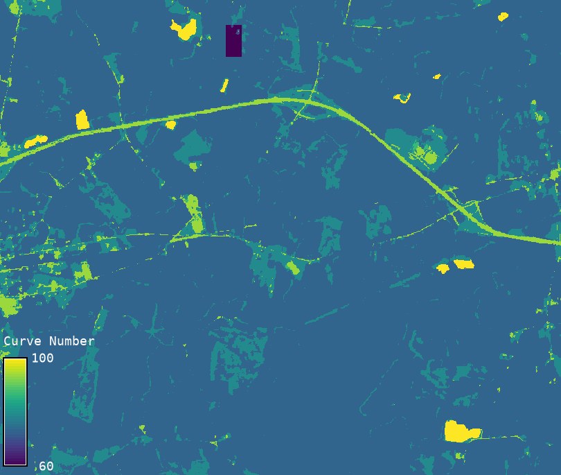

## DESCRIPTION

*r.curvenumber* computes a Curve Number (CN) raster
from a landcover classification raster and a
Hydrologic Soil Group (HSG) raster.
The Curve Number is a value that represents the
runoff potential of a soil–landcover combination
and is a key input in the USDA SCS Curve Number
method—a widely adopted practice in hydrology to estimate runoff.

It supports the lookup tables for curve number
values for the following datasets and provides:

- **Built-in NLCD lookup** (use the parameter `source=nlcd`)
- **Built-in ESA WorldCover lookup** (use the parameter `source=esa`)

For *custom* lookups, use the parameter `source=custom`,
and `lookup=/path/to/table.csv`. The CSV must have the header `lc,hsg,cn`.
Pass the custom lookup as a file or paste the values in the dialogue box.

HSG raster **must** contain only the following values:

- **1, 2, 3, 4** for Hydrologic Soil Groups A, B, C, D.
- **11, 12, 13, 14** for Dual HSGs A/D, B/D, C/D, D/D.

No other values are allowed.

The curve numbers used in *r.curvenumber* are based on values published by the
United States Department of Agriculture, Natural Resources Conservation Service (2004).
While these values serve as a widely accepted reference, users should
assess and, if needed, modify them to suit the specific requirements,
assumptions, and spatial scale of their hydrologic studies or engineering designs.

## EXAMPLES

```sh
# Example 1: NLCD lookup (built-in)
r.curvenumber \
  landcover=nlcd2019 \
  hsg=soil_hsg \
  ls=nlcd \
  output=cn_nlcd

# Example 2: ESA WorldCover lookup (built-in)
r.curvenumber \
  landcover=esa2020 \
  hsg=soil_hsg \
  ls=esa \
  output=cn_esa

# Example 3: Custom CSV lookup
r.curvenumber \
  landcover=my_lc_map \
  soil=my_hsg_map \
  ls=custom \
  lookup=cn_table.csv \
  output=cn_custom
```

  
*Figure: Example output from r.curvenumber*

## REFERENCES

- United States Department of Agriculture,
Natural Resources Conservation Service. (2004).
*National Engineering Handbook*, Part 630 Hydrology:
Chapter 9 Hydrologic Soil-Cover Complexes (210-VI-NEH).

## AUTHOR

[Abdullah Azzam](mailto:mabdazzam@outlook.com), New Mexico State University
