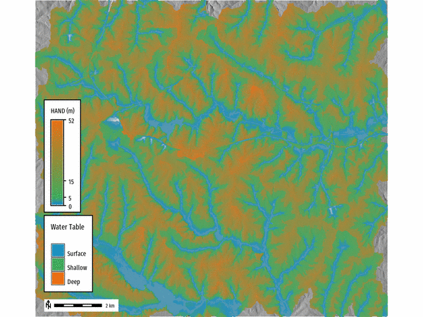

## DESCRIPTION

**r.hand** - Height Above Nearest Drainage (HAND) is a terrain-based model that
computes the height of the terrain above the nearest stream using a digital
elevation model (DEM) [Nobre et al., 2011](https://doi.org/10.1016/j.jhydrol.2011.03.051).
The HAND method is widely used for hydrological analysis, particularly for estimating
flood inundation extents based on user-defined water levels.

The tool generates flood inundation extent maps by applying the HAND method to a
DEM. Users can optionally provide streams and flow direction raster maps to
improve processing efficiency and accuracy. The tool will return an inundation
raster map or time series (STRDS) of inundation raster maps based on user-defined
water levels. Additionally, the HAND raster map can be returned as an output if
desired by setting the *difference* parameter.

## Dependencies

### GRASS Addons

- [r.stream.distance](addons/r.stream.distance.md)
- [r.lake.series](addons/r.lake.series.md)

## EXAMPLES

### Calculate an inundation raster map from a DEM raster map

```bash
r.hand elevation=elevation hand=hand depth=2 inundation_raster=inundation
```

  
*Figure: Inundation event $2 m$.*

### Calculate series of inundation raster maps from a DEM raster map

```bash
r.hand -t elevation=elevation hand=hand inundation_strds=inundation_strds \
start_water_level=0 end_water_level=5 water_level_step=1
```

### Output HAND raster in addition to inundation raster(s)

```bash
r.hand elevation=elevation hand=hand depth=4 threshold=5000 \
inundation_raster=inundation
```

The HAND raster is classified according to Nobre et al (2011) where:

| HAND Range       | Classification        |
|------------------|-----------------------|
| 0 < HAND < 5 m   | Surface Water Table   |
| 5 < HAND < 15 m  | Shallow Water Table   |
| HAND > 15 m      | Deep Water Table      |


*Figure: Height Above Nearest Drainage (HAND)*

```bash
# Reclassify HAND raster into categories
r.reclass input=hand output=hand_reclass rules=- << EOF
-30000 thru 0 = NULL
1 thru 5 = 1 Surface
5 thru 15 = 2 Shallow
15 thru 30000 = 3 Deep
EOF

# Set color table for HAND raster
r.colors map=hand_reclass rules=- << EOF
1 #1d91c0
2 #41ab5d
3 #ec7014
nv white
default grey
EOF
```


*Figure: Height Above Nearest Drainage (HAND) water table classification.*

## REFERENCES

- Nobre, A.D., Cuartas, L.A., Hodnett, M., Rennó, C.D., Rodrigues, G., Silveira,
 A., Waterloo, M., Saleska, S., 2011. Height Above the Nearest Drainage – a
hydrologically relevant new terrain model. Journal of Hydrology 404, 13–29. <https://doi.org/10.1016/j.jhydrol.2011.03.051>

## SEE ALSO

*[r.watershed](r.watershed.md), [r.lake](r.lake.md), [r.lake.series](addons/r.lake.series.md)*

## AUTHORS

Corey T. White [OpenPlains Inc.](https://openplains.com)
