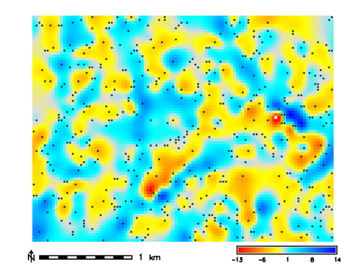
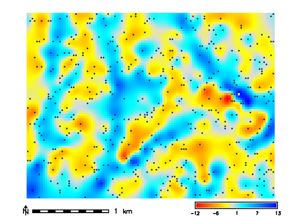
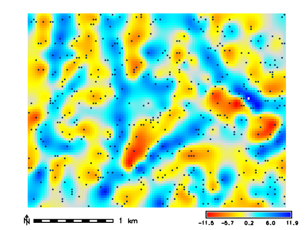
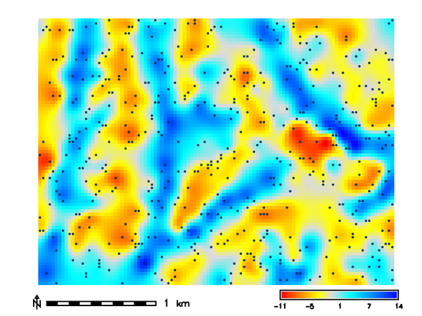

## DESCRIPTION

**v.surf.rst.cv** - Cross-validation of regularized spline with tension (RST)
surface model.

Predictive error of surface approximation for given parameters are
computed and a cross-validation procedure is then performed using the
data given in the vector map input. The estimated predictive errors are
stored in the optionally saved vector point map cvdev.

For larger data sets, CV should be applied to a representative subset of the
data. The cross-validation procedure works well only for well-sampled phenomena
and when minimizing the predictive error is the goal. The parameters found by
minimizing the predictive (CV) error may not not be the best for for poorly
sampled phenomena (result could be strongly smoothed with lost details and
fluctuations) or when significant noise is present that needs to be smoothed out.

## EXAMPLES

```python
import grass.script as gs

gs.run_command(
    "g.region",
    raster="elevation",
    res=30,
    n=220790,
    s=218390,
    w=632680,
    e=635910,
    flags="a",
)

# Extract random elevation points from the DEM
gs.run_command(
    "r.random",
    input="elevation",
    npoints=500,
    seed=0,
    vector="points",
    flags="z",
    overwrite=True,
)

# Run the cross validation proceedure
# using the random points
gs.run_command('v.surf.rst.cv',
    point_cloud="points",
    tension=[10, 100],
    smooth=[0.5, 5.0],
    segmax=600,
    format="json",
    output_file="test_cv.json",
    cv_prefix='cvdev',
    overwrite=True
)
```

By setting the **output_file** and **format** options the output of the above
command will be a JSON file with the
cross-validation results. The file will contain the following information:

```json
[
    {
        "tension": "10",
        "smooth": "0.5",
        "rmse": 3.938792429360747,
        "mae": 3.2086477739999997
    },
    {
        "tension": "10",
        "smooth": "5.0",
        "rmse": 4.921535874096144,
        "mae": 4.075445157999998
    },
    {
        "tension": "100",
        "smooth": "0.5",
        "rmse": 2.715355217413409,
        "mae": 2.0061099599999994
    },
    {
        "tension": "100",
        "smooth": "5.0",
        "rmse": 3.438609351379808,
        "mae": 2.73388017
    }
]
```

A report of the best parameter combination and the RMSE and MAE
values will be printed to the stderr.

```text
Best parameter combination
--------------------------------------------------
Tension: 100
Smoothing: 0.5
RMSE: 2.715355217413409
MAE: 2.0061099599999994
--------------------------------------------------
```

When the **cv_prefix** option is set, the vector point maps with the
cross-validation results will be saved and interpolated into a new surface that
displays the residuals of the cross-validation. The surface will be saved in the
current mapset with the name `<cv_prefix>_<tension>_<smooth>`.

  
*Tension: 100 Smooth: 0.5*
  
*Tension: 100 Smooth: 5*
  
*Tension: 10 Smooth: 0.5*
  
*Tension: 10 Smooth: 5*

## REFERENCES

- Mitasova, H., Mitas, L. and Harmon, R.S., 2005, Simultaneous spline
approximation and topographic analysis for lidar elevation data in open source
GIS, IEEE GRSL 2 (4), 375- 379.
- Hofierka, J., 2005, Interpolation of Radioactivity Data Using Regularized
Spline with Tension. Applied GIS, Vol. 1, No. 2, pp. 16-01 to 16-13. DOI: 10.2104/ag050016
- Hofierka J., Parajka J., Mitasova H., Mitas L., 2002, Multivariate
Interpolation of Precipitation Using Regularized Spline with Tension.
Transactions in GIS 6(2), pp. 135-150.
- H. Mitasova, L. Mitas, B.M. Brown, D.P. Gerdes, I. Kosinovsky, 1995, Modeling
spatially and temporally distributed phenomena: New methods and tools for
GRASS GIS. International Journal of GIS, 9 (4), special issue on Integrating
GIS and Environmental modeling, 433-446.
- Mitasova, H. and Mitas, L., 1993: Interpolation by Regularized Spline with
Tension: I. Theory and Implementation, Mathematical Geology ,25, 641-655.
- Mitasova, H. and Hofierka, J., 1993: Interpolation by Regularized Spline
with Tension: II. Application to Terrain Modeling and Surface Geometry
Analysis, Mathematical Geology 25, 657-667.
- Mitas, L., and Mitasova H., 1988, General variational approach to the
approximation problem, Computers and Mathematics with Applications, v.16, p. 983-992.
- Neteler, M. and Mitasova, H., 2008, Open Source GIS: A GRASS GIS Approach,
3rd Edition, Springer, New York, 406 pages.
- Talmi, A. and Gilat, G., 1977 : Method for Smooth Approximation of Data,
Journal of Computational Physics, 23, p.93-123.
- Wahba, G., 1990, : Spline Models for Observational Data, CNMS-NSF
Regional Conference series in applied mathematics, 59, SIAM,
Philadelphia, Pennsylvania.

## SEE ALSO

*[v.surf.rst](v.surf.rst.md)*

## AUTHORS

Corey T. White [NCSU GeoForAll Lab](https://geospatial.ncsu.edu/geoforall/)
